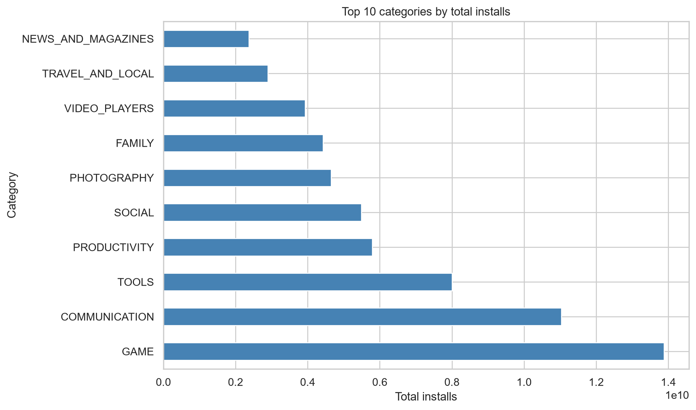
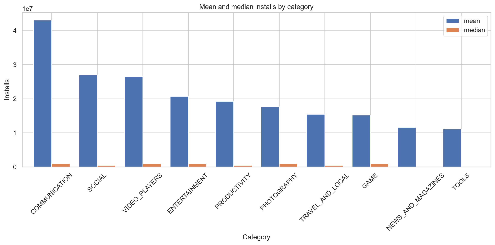
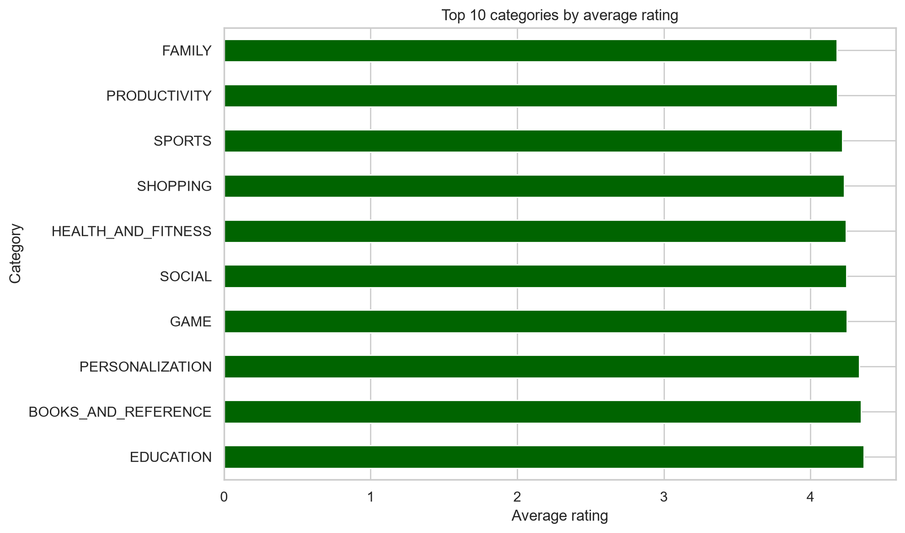
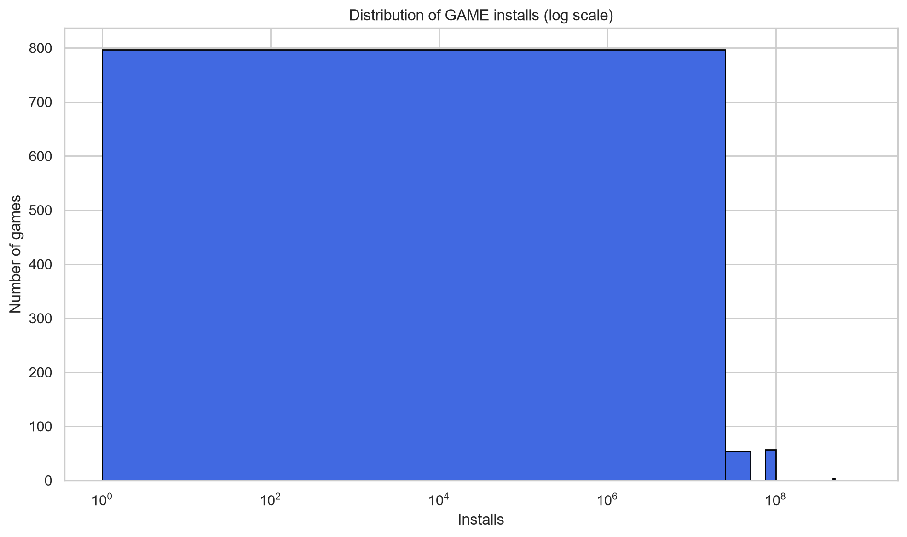

# Google Play Store App Analysis

This project studies the Google Play Store to understand category-level market opportunity, install concentration, and startup strategy. The analysis uses the cleaned dataset consistently throughout so that business conclusions reflect the final, validated data rather than the raw file.

## Business Questions

1. Which category dominates the market?
2. Which category is safer for a startup?
3. Which category is more suitable for a passive-income model?

## Final Decision on Data Quality

The analysis uses the cleaned dataset in all reporting and charts:
- Duplicate apps were removed using the first valid app name entry.
- The misaligned row at index 10472 was removed.
- Ratings above 5.0 were rejected as invalid.
- Missing ratings were removed because the rating-based analysis would otherwise be distorted.
- Install counts were converted from strings to numeric values to support category-level growth and market-size analysis.

This is the critical consistency fix: the raw dataset mentioned a GAME total of roughly 35 billion installs, but after cleaning the dataset, GAME is still the largest category by scale at about 13.88 billion installs. All final conclusions in this project follow the cleaned data.

## Notebook Links

- [notebooks/Reading_data_in_general.ipynb](notebooks/Reading_data_in_general.ipynb)
- [notebooks/GAME.ipynb](notebooks/GAME.ipynb)

## Featured Charts

The four charts below are generated directly by the notebooks and saved as PNG files in [`assets/`](assets/), so they are visible in GitHub and can be reproduced by rerunning the analysis.

### 1. Market size by category



GAME leads the cleaned dataset in total installs, confirming its enormous reach while also highlighting the scale of the competitive market.

### 2. Mean versus median installs



The large gap between mean and median in leading categories shows strong right-skew and winner-takes-most dynamics, which increases entry risk for startups.

### 3. Average rating by category



High average ratings make EDUCATION a more attractive candidate for a focused startup, especially when user satisfaction matters more than maximum scale.

### 4. GAME install distribution



The log-scale distribution shows that a small number of games capture very large install volumes while most games remain much smaller. This supports the recommendation to treat GAME as a high-reward, high-risk category.

## Key Business Insights

1. GAME remains the largest category in total market size, at roughly 13.88B installs after cleaning, but it is extremely competitive and highly skewed.
2. COMMUNICATION has a higher average install count per app, which suggests strong network effects and monetization potential, but it is also more difficult for new entrants to break into.
3. EDUCATION offers a safer startup path because it combines relatively high ratings with lower saturation than GAME and less extreme concentration than the top communication apps.

## Final Recommendation

For a startup, the best strategic path is not to chase the largest market alone. GAME offers massive scale, but it is winner-takes-most and requires a strong advantage in distribution, retention, or community. A more realistic and safer route is to build in EDUCATION or a productivity-style niche where user satisfaction is high, competition is more manageable, and the business can be more predictable.

For a passive-income model, EDUCATION and utility-oriented categories are more feasible than a mass-market GAME launch because they usually require less constant customer acquisition pressure and can be built around repeat engagement, subscription value, or content-based monetization.

## Dataset Summary

- Source: Google Play Store app metadata
- Final analysis dataset: cleaned Google Play Store export
- Main variables: App, Category, Rating, Reviews, Installs, Price, Genres, and related performance metrics

## Project Structure

```text
notebooks/
├── Reading_data_in_general.ipynb  # Market overview, category analysis, and business conclusion
└── GAME.ipynb                     # GAME-specific breakdown, genre analysis, and pricing model insights
```

## How to Run

```bash
pip install pandas matplotlib seaborn numpy jupyter
jupyter notebook notebooks/Reading_data_in_general.ipynb
jupyter notebook notebooks/GAME.ipynb
```

## Author

cathuyson2010

## License

This project is open source and available under the MIT License.