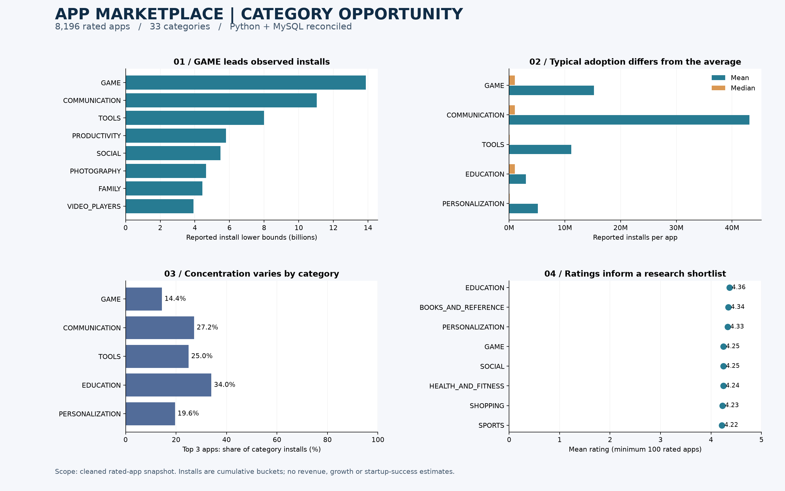

# Google Play Store App Marketplace Analysis

A reproducible Python + MySQL portfolio project examining category scale,
typical adoption, ratings and install concentration in a cleaned app snapshot.

## Business questions

1. Which categories lead aggregate reported installs in this sample?
2. How do typical installs and concentration differ across categories?
3. How do Free/Paid games compare, and what can the data say about product opportunities?

## At a glance

- **8,196 unique app names; 33 categories; 13 source fields.**
- **12 analytical SQL queries:** JOINs, CTEs, subqueries and window functions.
- Full CSV-to-MySQL field reconciliation before promoting the imported table.
- Two executed notebooks, a four-panel dashboard and three CSV summary exports.



## Verified findings

| Category | Apps | Total reported installs | Median installs | Top 3 share |
|---|---:|---:|---:|---:|
| GAME | 912 | 13,878,762,717 | 1,000,000 | 14.41% |
| COMMUNICATION | 256 | 11,038,241,530 | 1,000,000 | 27.18% |
| EDUCATION | 118 | 352,852,000 | 1,000,000 | 34.01% |
| PERSONALIZATION | 298 | 1,532,352,930 | 100,000 | 19.58% |

GAME leads aggregate installs, but its mean (15.22M) is far above its median (1M).
EDUCATION has a higher mean rating (4.364 versus GAME 4.247), yet its top-three
install share is higher too. This does **not** establish a safer startup category.
Within GAME, 836 Free apps average 4.236 in ratings; 76 Paid apps average 4.372.
These are associations, not causal effects of price or evidence of profitability.

## Data and methodology

Input: the supplied Google Play Store CSV, containing 10,841 rows and 13 columns.
The original download URL and data license are not recorded in the supplied files.
Keep the first record for each app name, remove the misaligned record, reject invalid
ratings and exclude missing ratings to reproduce the existing rated-app sample.
Normalize numeric fields and lowercase column names. Deduplication uses app names
because package IDs are absent; identical names may represent distinct products.
Removing unrated apps is a scope choice and can bias install comparisons.
Do not interpret cumulative install lower-bound buckets as exact downloads, active
users, current growth, revenue or complete market size.
The data lacks acquisition cost, retention, maintenance cost and real revenue.
Startup safety and passive income remain research questions, not proven conclusions.

## Run the Python workflow

From the repository root, create/activate a Python environment and install:
```bash
pip install -r requirements.txt
jupyter nbconvert --to notebook --execute --inplace notebooks/Reading_data_in_general.ipynb notebooks/GAME.ipynb
python scripts/build_portfolio_report.py
```
The overview notebook exports the cleaned CSV; GAME reads that same file.
Both notebooks discover the project root and can run from the root or notebooks folder.
The report script regenerates the dashboard and all three summary CSV files.

## Run the SQL workflow

See [sql/README.md](sql/README.md) for saved-login setup and reproducible import.
Execute sql/01_create_database.sql, run python sql/import_cleaned.py,
then execute sql/02_data_validation.sql and sql/03_business_analysis.sql.
The importer checks every source field before an atomic rename and retains the old table.

## Explore the evidence

- [Market overview notebook](notebooks/Reading_data_in_general.ipynb)
- [GAME notebook](notebooks/GAME.ipynb)
- [SQL questions](sql/03_business_analysis.sql)
- [Category results](reports/category_summary.csv)
- [GAME Free/Paid results](reports/game_free_paid.csv)
- [GAME genre results](reports/game_genres.csv)
- [Executive summary](reports/executive_summary.md)

## Validation

Both notebooks execute successfully from a fresh kernel in the project environment.
All 12 SQL queries run on MySQL 8.0.46. The verified import contains 8,196 rows,
33 categories and 912 GAME apps. The previous incomplete 317-row SQL table is retained.
The original import failure trigger is unknown; the diagnosed issue was incomplete loading.

## Author

Huy Son Cat / cathuyson2010
